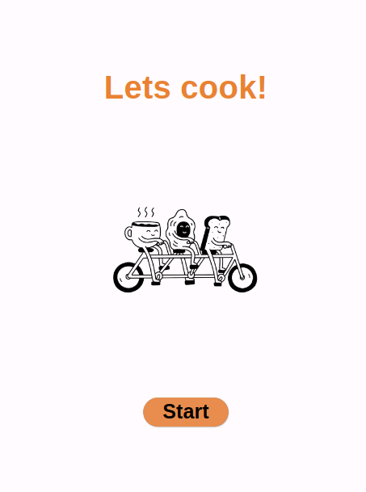
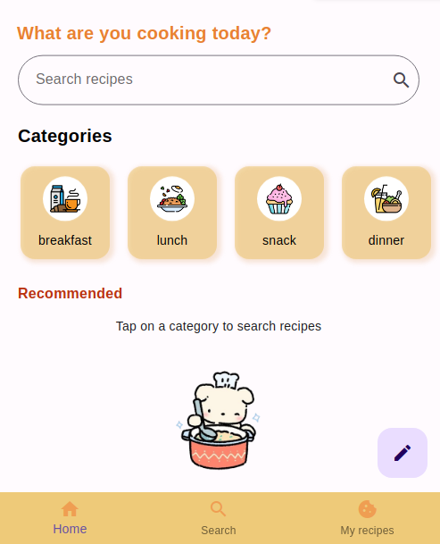
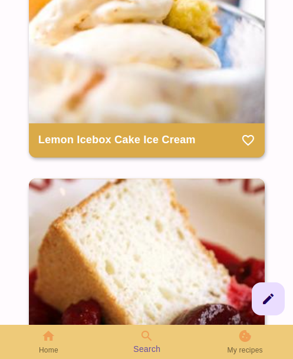
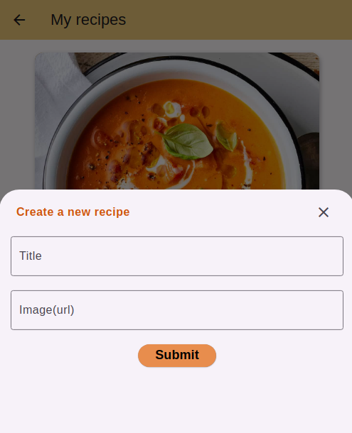
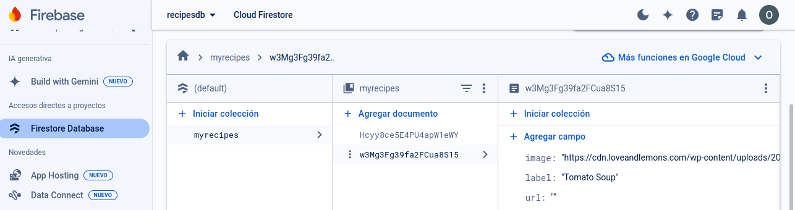
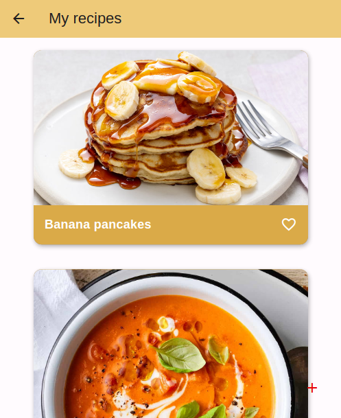

# My flutter recipes app 🍽

### Aplicacions hírides. Projecte final aplicación Flutter 

## Descripción

Esta aplicación de recetas está diseñada para buscar y crear tus propias recetas. Utiliza la **API Edamam** para encontrar recetas existentes y **Firebase Firestore** para guardar y obtener las recetas creadas.

## Características Principales 

* **Búsqueda de Recetas:** Utiliza la **API Edamam** para buscar recetas por categoría o mediante palabras claves introducidas por el campo de búsqueda.

* **Creación de Recetas Personalizadas:** Se pueden crear recetas propias que se guardan en la colección “myrecipes” en **Cloud Firestore**.

* **Interfaz de Usuario Intuitiva:** La aplicación consta de tres Screens:

### 1. Pantalla de Inicio

### 2. Pantalla de Búsqueda de Recetas

* **Categorías:** Muestra una lista de categorías de recetas (por ejemplo, **“breakfast”**, **“lunch”**, **“snack”**, **"dinner"** etc.).

* **Búsqueda por Texto:** Permite a los usuarios buscar recetas ingresando palabras clave en un campo de texto.

* **Resultados de Búsqueda:** Muestra las recetas coincidentes en forma de tarjetas (utilizando el widget Card).

  

### 3. Pantalla de Creación de Recetas

* **Formulario de Creación:** Widget **BottomModalSheet** que abre un formulario para ingresar los detalles de la receta, nombre y url de la imagen para crear el **modelo Recipe**.

* **Guardar en Firestore:** Al hacer submit, la receta se guarda en la colección **“myrecipes”** en Firestore.

* **Navegación:** Utiliza el widget Navigator para alternar entre las pantallas de búsqueda y creación.

## Modelos 

* **recipes.dart:** Clase Recipe con contructor (name, image, url.) y método para crear instancias Recipe.
* **categories.dart:** Clase Categories que define un módelo básico para el widget categorias.

## Widgets Utilizados ⚙️

* **Card:** Para mostrar las recetas en forma de tarjetas con imágenes.

* **BottomNavigationBar:** Para simular la navegación entre las diferentes pantallas.

* **Form:** Para obtener los datos de la receta en la pantalla de My recipes.

* **Navigator:** Para cambiar entre las pantallas de inicio, búsqueda y creación.

* **ModalBottomSheet:** Widget de Material para mostrar el formulario sin necesidad de crear otra pantalla.

## Configuración 🛠

1. Clona el repositorio.

2. Configura tu proyecto en Firebase y obtén las credenciales necesarias.

3. Actualiza las configuraciones de Firebase en la aplicación Flutter.

## Ejecución 💻📲

* Ejecuta flutter pub get para instalar las dependencias.

* Ejecuta la aplicación en tu dispositivo o emulador.

### Oriana Rojas.
